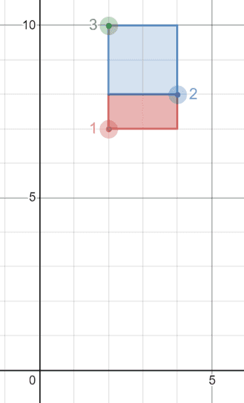

## 🚀 1459. Rectangles Area 🔒

### 📖 Problem

Write a solution to report all possible **axis-aligned** rectangles with a **non-zero area** that can be formed by any two points from the `Points` table.

Each row in the result should contain three columns `(p1, p2, area)` where:

- `p1` and `p2` are the `id`'s of the two points that determine the opposite corners of a rectangle.
- `area` is the area of the rectangle and must be **non-zero**.
  
Return the result table **ordered** by `area` in **descending** order. If there is a tie, order them by `p1` in **ascending** order. If there is still a tie, order them by `p2` in **ascending** order.

---

### 📝 Example



<p align="center">
  
</p>

```text
Input: 
Points table:
+----------+-------------+-------------+
| id       | x_value     | y_value     |
+----------+-------------+-------------+
| 1        | 2           | 7           |
| 2        | 4           | 8           |
| 3        | 2           | 10          |
+----------+-------------+-------------+
Output: 
+----------+-------------+-------------+
| p1       | p2          | area        |
+----------+-------------+-------------+
| 2        | 3           | 4           |
| 1        | 2           | 2           |
+----------+-------------+-------------+
Explanation: 
The rectangle formed by p1 = 2 and p2 = 3 has an area equal to |4-2| * |8-10| = 4.
The rectangle formed by p1 = 1 and p2 = 2 has an area equal to |2-4| * |7-8| = 2.
Note that the rectangle formed by p1 = 1 and p2 = 3 is invalid because the area is 0.
```
---

### 💡 Idea

Use a **self join** to compare every pair of points. Two points can form the opposite corners of an axis-aligned rectangle only when they have different `x` values and different `y` values. The area is the product of the differences in their coordinates.

---

### 💻 Solution

```sql
SELECT p1.id AS p1, p2.id AS p2,
ABS(p1.x_value - p2.x_value) * ABS(p1.y_value - p2.y_value) AS area
FROM Points p1
JOIN Points p2 ON p1.id < p2.id
WHERE p1.x_value <> p2.x_value
  AND p1.y_value <> p2.y_value
ORDER BY area DESC, p1 ASC, p2 ASC;
```

---

### 🛠️ How It Works

1. Self join `Points` to generate pairs of points.
2. Use `p1.id < p2.id` to avoid duplicate pairs and pairing a point with itself.
3. Require different `x` and `y` coordinates so the rectangle has non-zero area.
4. Calculate the area using the horizontal and vertical distances.
5. Sort by area descending, then `p1` and `p2` ascending.

---

### ⏱️ Complexity

**Time Complexity:** `O(n²)` *(all possible pairs of points are compared)*

**Space Complexity:** `O(n)` *(for the result set)*
